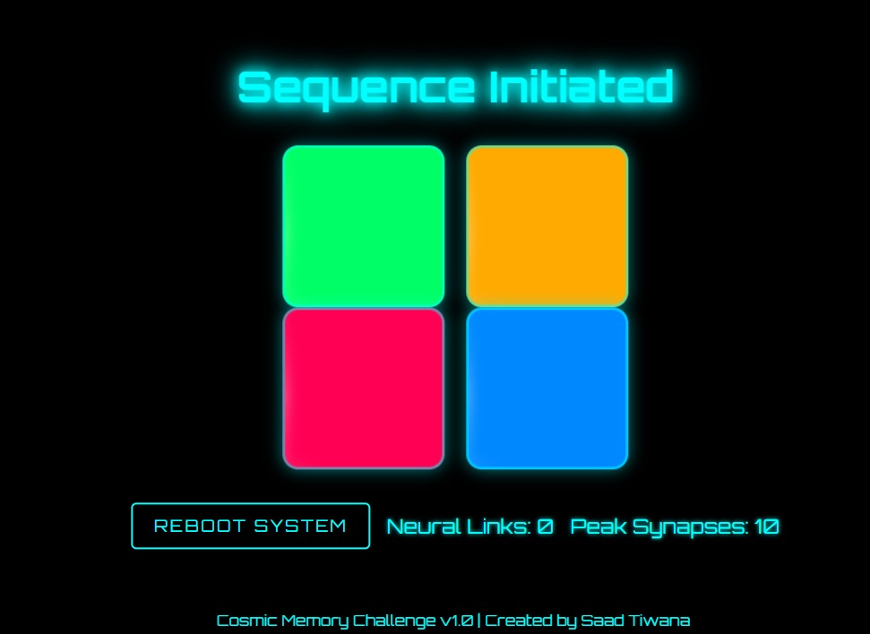

# Cosmic Memory Challenge 🚀🌌

## Overview
Welcome to **Futuristic Simon: Cosmic Memory Challenge** — a mesmerizing, space-themed memory game designed to test and enhance your cognitive reflexes. Dive into the cosmos, follow the light sequences, and prove your neural capacity in this exciting game built with HTML, CSS, and JavaScript.

**Game Features**:
- ✨ Space-themed visuals with animated stars and glowing neon buttons
- 🎮 Interactive gameplay based on the Simon game mechanics
- 🎵 Sound effects for each button press and game over
- 💥 Stunning animations powered by GSAP (GreenSock Animation Platform)
- 🌟 High scores to track your progress
- 🚀 Cosmic vibes with a futuristic UI

## Gameplay
- Click the **"Initiate Sequence"** button to start the game.
- Follow the sequence of flashing buttons in the correct order.
- As you progress, the sequence gets longer and more challenging.
- If you make an error, the game ends, and you’ll need to reboot the system to try again.
- Keep an eye on the **Neural Links** and **Peak Synapses** (score and high score).

## Screenshot
Here’s a sneak peek of what the game looks like:



## Technologies Used
- **HTML5** for the game structure
- **CSS3** for styling and animations
- **JavaScript (ES6)** for the game logic
- **GSAP** for smooth animations
- **Audio files** for immersive sound effects

## Installation Instructions
1. Clone the repository:
   ```bash
   git clone https://github.com/saadhtiwana/Cosmic-Memory-Challenge.git
Open the index.html file in your browser to play the game.
Contributors
Saad Tiwana (Creator)
Contact
For questions or suggestions, feel free to reach out via email:
📧 saadhayat799@gmail.com
